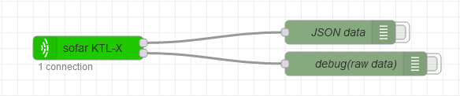
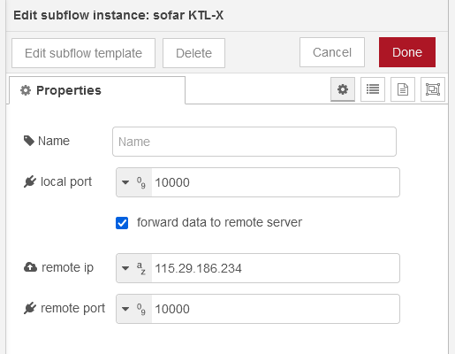

# Node-red server/proxy for Sofar inverters
- subflow captures messages from wifi logger and decode them into JSON message
- proxy data to default (solarmanpv.com (ginlong.com)) server
- uses v5 data frames

## supported devices:

- **Sofar 4.4KTL-X** with LSW-3 data logger (`SN: 17xxxxxxxx` `firmware: LSW3_14_FFFF_1.0.34`)  
- **Sofar ME3000SP (RETROFIT ZST-3000SP)** added by [mattiarossi](https://github.com/mattiarossi)  
- **Sofar HYD6000-ES** with LSW-3 data logger (`SN: 23xxxxxxxx` `firmware: LSW3_15_FFFF_1.0.65`) added by [daniel-pro](https://github.com/daniel-pro)  
- **Sofar 4.4KTLX-G3** with LSW-3 data logger (`SN: 23xxxxxxxx`) decoded by [grzegorzgrzeszkowiak](https://github.com/grzegorzgrzeszkowiak)  
- **Sofar HYD 10KTL-3PH** works (no info about data) [#12](https://github.com/serek4/node-red-sofar-inverter/issues/12)  
- **Sofar HYD 5KTL-EP** uses the same data frame as **Sofar 4.4KTLX-G3**, no battery info decoded [#13](https://github.com/serek4/node-red-sofar-inverter/issues/13)  

## wifi logger settings

go to `http://\<wifi logger local IP\>`  
in advanced tab set server B to `<node-red IP>` on port `10000` `TCP`  
  

## node-red settings

import [node-red-subflow](node-red-subflow.json) to node-red, u will get sofar inverter node in subflow category  
  
now your `sofar inverter` node should have 1 connection and receive data  

`sofar inverter` default properties  
  
by default node will listen on TCP port 10000, and will resend data to default solarmanpv.com server as well  

## node-red did not connect

if `sofar inverter` node do not have active connection  
go to `http://\<wifi logger local IP\>/config_hide.html`  
and change server A (default server) to `<node-red IP>`  
  

---
## data messages

- Sofar [KTL-X](messages/decode_data_KTL-X.md)
- Sofar [KTLX-G3 / HYD KTL-EP](messages/decode_data_KTLX-G3.md)
- Sofar [ME3000SP](messages/decode_data_me3000sp.md)
- Sofar [HYD6000-ES](messages/decode_data_HYD6000ES.md)

## messages flow

### after power on:

wifi logger ([hello msg](messages/decode_hello-msg.md)) -> server ([srv-response msg](messages/decode_srv-response.md)) -> wifi logger  
wifi logger ([data msg](README.md#data-messages)) -> server ([srv-response msg](messages/decode_srv-response.md)) -> wifi logger  
wifi logger ([hello cd msg](messages/decode_hello_cd-msg.md)) -> server ([srv-response msg](messages/decode_srv-response.md)) -> wifi logger  
wifi logger ([hello end msg](messages/decode_hello_end-msg.md)) -> server ([srv-response msg](messages/decode_srv-response.md)) -> wifi logger  

### 120s interval:

wifi logger ([heartbeat msg](messages/decode_heartbeat.md)) -> server ([srv-response msg](messages/decode_srv-response.md)) -> wifi logger

### 5min interval:

wifi logger ([data msg](README.md#data-messages)) -> server ([srv-response msg](messages/decode_srv-response.md)) -> wifi logger  

### ~3h interval:

wifi logger ([hello msg](messages/decode_hello-msg.md)) -> server ([srv-response msg](messages/decode_srv-response.md)) -> wifi logger  
wifi logger ([data msg](README.md#data-messages)) -> server ([srv-response msg](messages/decode_srv-response.md)) -> wifi logger  
wifi logger ([hello cd msg](messages/decode_hello_cd-msg.md)) -> server ([srv-response msg](messages/decode_srv-response.md)) -> wifi logger  
wifi logger ([hello end msg](messages/decode_hello_end-msg.md)) ->server ([srv-response msg](messages/decode_srv-response.md)) -> wifi logger

### other messages:

sended after some connection problems (presumably)  
[60bytes msg](messages/decode_60.md) and [44bytes msg](messages/decode_44.md)  
