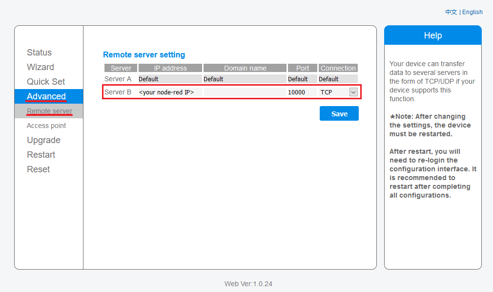

# Node-red server/proxy for Sofar solar wifi stick

- flow captures messages from wifi stick and decode them into JSON message
- can act as a proxy to solarmanpv.com (ginlong.com) server
- uses v5 protocol

## wifi stick:

    SN: 174xxxxxxx
    firmware: LSW3_14_FFFF_1.0.34

## wifi stick settings

go to `http://\<wifi stick local IP\>`  
in advanced tab set server B to `<node-red IP>` on port `10000` `TCP`  
  

## node-red settings

import [node-red-subflow](node-red-subflow.json) to node-red, u will get sofar KTL-X node in subflow category  
  
now your `sofar KTL-X` node should have 1 connection and receive data  

sofar KTL-X default properties  
  
by default node will listen on TCP port 10000, and will resend data to default solarmanpv.com server as well  

## node-red did not connect

if `sofar KTL-X` node do not have active connection  
go to `http://\<wifi stick local IP\>/config_hide.html`  
and change server A (default server) to `<node-red IP>`  
  

---
## messages flow

### after power on:

wifi stick ([hello msg](messages/decode_hello-msg.md)) -> server ([srv-response msg](messages/decode_srv-response.md)) -> wifi stick  
wifi stick ([data msg](messages/decode_data.md)) -> server ([srv-response msg](messages/decode_srv-response.md)) -> wifi stick  
wifi stick ([hello cd msg](messages/decode_hello_cd-msg.md)) -> server ([srv-response msg](messages/decode_srv-response.md)) -> wifi stick  
wifi stick ([hello end msg](messages/decode_hello_end-msg.md)) -> server ([srv-response msg](messages/decode_srv-response.md)) -> wifi stick  

### 120s interval:

wifi stick ([heartbeat msg](messages/decode_heartbeat.md)) -> server ([srv-response msg](messages/decode_srv-response.md)) -> wifi stick

### 5min interval:

wifi stick ([data msg](messages/decode_data.md)) -> server ([srv-response msg](messages/decode_srv-response.md)) -> wifi stick

### ~3h interval:

wifi stick ([hello msg](messages/decode_hello-msg.md)) -> server ([srv-response msg](messages/decode_srv-response.md)) -> wifi stick  
wifi stick ([data msg](messages/decode_data.md)) -> server ([srv-response msg](messages/decode_srv-response.md)) -> wifi stick  
wifi stick ([hello cd msg](messages/decode_hello_cd-msg.md)) -> server ([srv-response msg](messages/decode_srv-response.md)) -> wifi stick  
wifi stick ([hello end msg](messages/decode_hello_end-msg.md)) ->server ([srv-response msg](messages/decode_srv-response.md)) -> wifi stick

### other messages:

sended after some connection problems (presumably)  
[60bytes msg](messages/decode_60.md) and [44bytes msg](messages/decode_44.md)  
